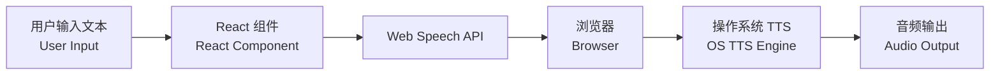

# TTS Implementation - Quick Reference (快速参考)

## 核心问题解答 (Core Questions Answered)

### 1️⃣ 这个仓库是怎么实现 TTS 的？
**How does this repository implement TTS?**

- **使用技术**: 浏览器原生 Web Speech API
- **Technology**: Browser native Web Speech API
- **核心接口**: `window.speechSynthesis` 和 `SpeechSynthesisUtterance`
- **Core Interfaces**: `window.speechSynthesis` and `SpeechSynthesisUtterance`
- **实现位置**: `App.tsx` 文件的 `handlePlay` 函数
- **Implementation Location**: `handlePlay` function in `App.tsx`

```typescript
// 核心代码 (Core Code)
const utter = new SpeechSynthesisUtterance(text);
const voice = voices.find(v => v.name === selectedVoice);
if (voice) utter.voice = voice;
window.speechSynthesis.speak(utter);
```

### 2️⃣ 需要什么依赖？
**What dependencies are required?**

#### 运行时依赖 (Runtime Dependencies):
```json
{
  "react": "^19.2.3",
  "react-dom": "^19.2.3",
  "lucide-react": "^0.562.0"
}
```

#### 开发依赖 (Development Dependencies):
```json
{
  "typescript": "~5.8.2",
  "vite": "^6.2.0",
  "@vitejs/plugin-react": "^5.0.0",
  "@types/node": "^22.14.0"
}
```

#### 外部资源 (External Resources):
- Tailwind CSS (CDN)
- Google Fonts - Inter
- ESM.sh (for module imports)

### 3️⃣ 是逆向了微软的接口吗？
**Does it use reverse-engineered Microsoft APIs?**

**❌ 不是！(NO!)**

- ✅ 使用的是 **W3C 标准 API**
- ✅ Uses **W3C standard API**
- ✅ 完全公开和合法
- ✅ Completely public and legal
- ✅ 不需要任何 API 密钥
- ✅ No API keys required
- ✅ 不涉及任何逆向工程
- ✅ No reverse engineering involved

**微软语音的来源 (Source of Microsoft Voices):**
- 通过浏览器访问操作系统的 TTS 引擎
- Accessed via browser to OS TTS engine
- Windows 系统自带 Microsoft TTS 引擎
- Windows includes Microsoft TTS engine natively
- Edge 浏览器通过标准 API 暴露这些语音
- Edge browser exposes these voices through standard API

---

## 技术栈 (Tech Stack)

| 层级 (Layer) | 技术 (Technology) | 用途 (Purpose) |
|-------------|------------------|---------------|
| 前端框架 (Frontend) | React 19.2.3 | UI 组件 (UI Components) |
| 构建工具 (Build) | Vite 6.2.0 | 开发和构建 (Dev & Build) |
| 语言 (Language) | TypeScript 5.8.2 | 类型安全 (Type Safety) |
| 样式 (Styling) | Tailwind CSS | UI 样式 (UI Styling) |
| TTS 引擎 (TTS) | Web Speech API | 语音合成 (Speech Synthesis) |
| 图标 (Icons) | Lucide React | UI 图标 (UI Icons) |

---

## 工作流程 (Workflow)



---

## 快速开始 (Quick Start)

```bash
# 克隆仓库 (Clone repository)
git clone https://github.com/finalfree/Web-TTS.git
cd Web-TTS

# 安装依赖 (Install dependencies)
npm install

# 启动开发服务器 (Start dev server)
npm run dev

# 访问 (Visit)
# http://localhost:3000
```

---

## 关键代码位置 (Key Code Locations)

| 文件 (File) | 功能 (Function) | 行号 (Lines) |
|------------|----------------|-------------|
| `App.tsx` | TTS 实现 (TTS Implementation) | 76-108 |
| `App.tsx` | 语音加载 (Voice Loading) | 29-67 |
| `AudioVisualizer.tsx` | 波形显示 (Waveform Display) | 24-77 |
| `package.json` | 依赖配置 (Dependencies) | 11-22 |
| `index.html` | 外部资源 (External Resources) | 7-41 |

---

## 浏览器兼容性 (Browser Compatibility)

| 浏览器 (Browser) | 支持 (Support) | 语音质量 (Voice Quality) |
|-----------------|---------------|------------------------|
| Microsoft Edge | ✅ 完美 (Perfect) | ⭐⭐⭐⭐⭐ 最佳 (Best) |
| Google Chrome | ✅ 良好 (Good) | ⭐⭐⭐⭐ 很好 (Very Good) |
| Firefox | ✅ 支持 (Supported) | ⭐⭐⭐ 一般 (Fair) |
| Safari | ✅ 支持 (Supported) | ⭐⭐⭐ 一般 (Fair) |

---

## 优势与局限 (Pros & Cons)

### ✅ 优势 (Advantages)

1. 🆓 **完全免费** - Free to use
2. 🔒 **保护隐私** - Client-side, privacy-friendly
3. 🌐 **无需服务器** - No server required
4. 🚀 **即时响应** - Instant response
5. 🌍 **多语言支持** - Multi-language support

### ⚠️ 局限 (Limitations)

1. 📱 **依赖系统** - Depends on OS/browser voices
2. 🎙️ **质量差异** - Voice quality varies
3. 📊 **无音频流** - No direct audio stream access
4. 🔧 **功能受限** - Limited by Web Speech API

---

## 安全性 (Security)

- ✅ 不存储任何用户数据 (No user data stored)
- ✅ 不发送网络请求 (No network requests)
- ✅ 纯前端运行 (Pure frontend)
- ✅ 无需 API 密钥 (No API keys needed)
- ✅ 开源可审计 (Open source & auditable)

---

## 推荐配置 (Recommended Setup)

**最佳体验 (Best Experience):**
- 💻 操作系统: Windows 10/11
- 🌐 浏览器: Microsoft Edge (最新版)
- 🔊 语音: Microsoft Natural voices
- 📡 网络: 任意 (Any - works offline after loading)

---

## 参考链接 (References)

- 📚 [Web Speech API - MDN](https://developer.mozilla.org/en-US/docs/Web/API/Web_Speech_API)
- 📖 [W3C Specification](https://w3c.github.io/speech-api/)
- 💻 [Repository](https://github.com/finalfree/Web-TTS)

---

**最后更新 (Last Updated)**: 2025-12-28  
**文档版本 (Doc Version)**: 1.0
